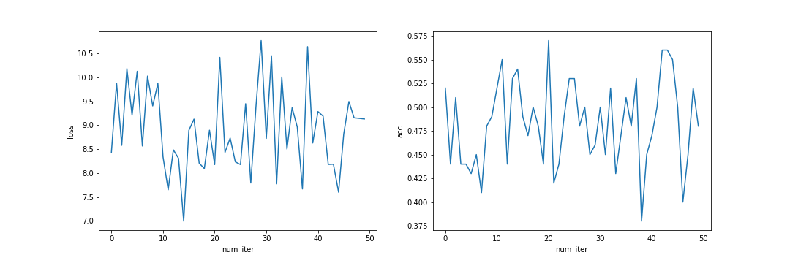
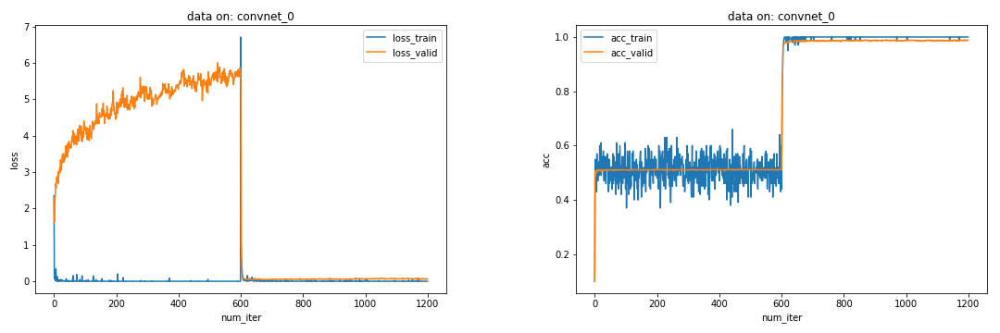
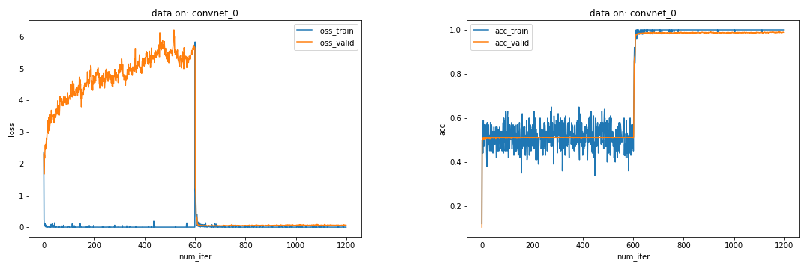
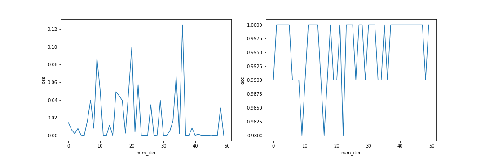
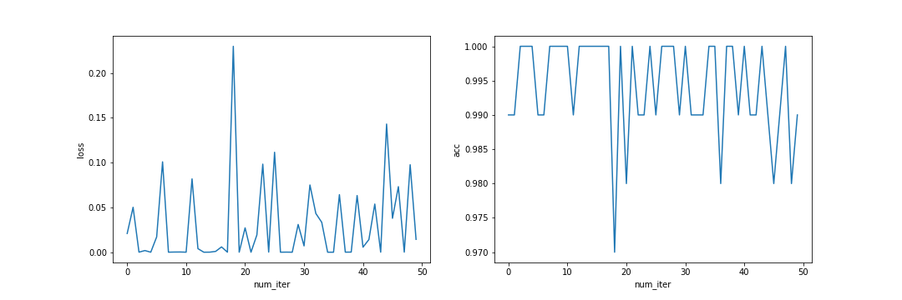
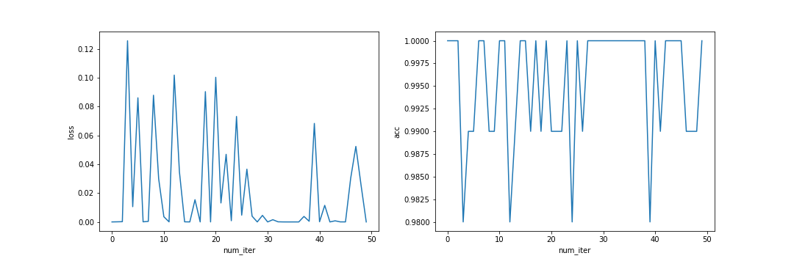
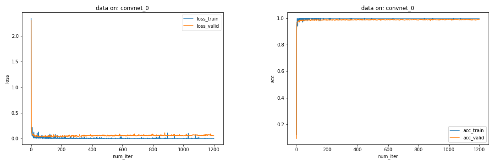

# 神经网络「学习学」

[TOC]

## （一）简述

本实验在数据集 MNIST 手写数字识别上进行，实验了 3 个卷积神经网络：

+ 卷积网络 0：先在数字 0~4 上训练，再在数字 5~9 上训练
+ 卷积网络 1：先在数字 0~4 上训练，再在数字 0~9 上训练
+ 卷积网络 2：直接在数字 0~9 上训练

本报告将主要探讨这三个网络的 2 个指标：

+ 误差曲线形状（损失函数值，曲线上简称为 `loss`）
+ 在测试集上的分类准确率（准确率，曲线上简称为 `acc`）

每个卷积神经网络在数据集上以其对应的训练方式独立进行了 5 次试验，给出每一次的训练数据，同时给出了平均数据。报告将对上述数据进行汇总分析。

## （二）实验方法

### 数据准备

实验数据集 MNIST 来自软件包 `torchvision`，具体引用的模块是 `torchvision.datasets.MNIST`，用于获取训练集数据（`data_train`）和测试集数据（`data_train`）；随后，使用 `torch.utils.data.DataLoader`、`torch.utils.data.sampler.SubsetRandomSampler` 等工具对数据集进行划分、采样并加载为数据迭代器，其中：

+ 训练集数据保持不变
+ 测试集数据被均分为 2 部分，测试集中下标为前半部分的数据被作为验证集，测试集中下标为后半部分的数据被作为测试集

上述三组生成的数据迭代器每次迭代的批量大小为 100；其中训练集迭代器在每一个完整的迭代周期（epoch）中将随机混洗所有数据。

### 模型定义

随后，实验展示了三个迭代器的数据分布，并定义了一个卷积神经网络类 `ConvNet`，该卷积神经网络的结构，大致为：

1. 每一层的激活函数均为 LeakyReLU
2. 输入数据
3. 3 组「卷积层+池化层」
4. 平铺结点
5. 3 层全连接
6. 将最后一层的激活值经过 LogSoftmax 处理后作为输出。

模型细节具体如下：

1. 输入端：通道数为 1，尺寸为 $28 \times 28$
2. 卷积层：通道数为 8，核尺寸为 $5 \times 5$，每边填充 2 个 0，步长数为 1；激活函数为 LeakyReLU
3. 池化层：最大池化法，核尺寸为 $2 \times 2$，步长数为 2
3. 卷积层：通道数为 16，核尺寸为 $5 \times 5$，每边填充 2 个 0，步长数为 1；激活函数为 LeakyReLU
4. 池化层：最大池化法，核尺寸为 $2 \times 2$，步长数为 2
4. 卷积层：通道数为 32，核尺寸为 $5 \times 5$，每边填充 2 个 0，步长数为 1；激活函数为 LeakyReLU
5. 池化层：最大池化法，核尺寸为 $2 \times 2$，步长数为 2
6. 平铺层：将上一层输出的所有结点（非一维形状）展平为一维形状
6. 全连接层：输出端为 1024 个结点；激活函数为 LeakyReLU
7. Dropout：以 0.5 的概率「丢弃」上一层的输出
7. 全连接层：输出端为 128 个结点；激活函数为 LeakyReLU
8. 批量正则化层
8. 全连接层：输出端为 10 个结点；激活函数为 LeakyReLU
9. 将上一层的 10 个值经过 LogSoftmax 处理，输出 10 个「概率」

### 训练过程

训练函数为 `train_net`。训练将执行若干个迭代周期（epoch），每个迭代周期里，网络将在**所有**训练数据上训练一遍。三个网络只有训练数据的次序上的不同，即：

1. 第一个网络先训练数字 0~4 共 50 个迭代周期、再在数字 5~9 上训练 50 个迭代周期
2. 第二组网络先在 0~4 上训练 50 个迭代周期、再在 0~9 上训练 50 个迭代周期
3. 第三组网络直接在 0~9 上训练 100 个迭代周期）

其余可控参数（即系统随机初始化的值以外）对于三个网络而言都是相同的，包括：

+ 损失函数采用交叉熵函数 `nn.CrossEntropyLoss`
+ 数值优化方法采用 `torch.optim.Adam`
+ 迭代周期数为 100
+ 每完成 100 个迭代周期，进行下一个试验时，均将网络重新初始化，即保证每组试验数据之间互不干扰

另外，在每个迭代周期内，每训练 50 个样本点，就将通过验证集迭代器在所有验证集上进行一次测试；在验证集上测试时，每次迭代记录该批量数据对应的损失值和准确率；在迭代完一轮验证集后，将对已记录的本轮所有验证结果求均值，并记录该均值（包括损失值、准确率），作为网络经过这 50 个样本点训练后的验证结果。

### 评估过程

神经网络输出的是 10 个「概率」值，因此在评估模型准确率时，要从输出的 10 个概率中挑选最大概率所对应的数字作为其真正预测值，评估函数 `evaludate_acc` 中将执行该处理。

在每次试验完成后（即每完成 100 个迭代周期后），神经网络将在测试集上进行测试，记录测试集迭代器迭代出的每一个批量对应的测试损失值和测试准确率。

### 辅助封装

为了使代码更可复用，简单编写了一个名为 `CoachTeam` 的类，该类将作为一个接口，封装了常用的接口，包括：

+ 训练接口（`train_helper`）
+ 测试接口（`test_helper`）
+ 工作流接口（`pipeline_helper`）
+ 存储接口（`save`）
+ 绘图接口（`plot_single` 、`plot_whole`）

其中 `pipeline_helper` 是本实验主要利用的接口，它将调用其余 4 个接口，完成对于给定的某个神经网络的训练、测试、存储、绘图功能。其主要流程简述如下：

1. 进行指定次数的试验（本实验中，试验次数为 5）。在每一次独立的实验内：
    1. 使用训练接口训练神经网络
    2. 在训练完成后，对该网络进行一次测试
    3. 测试完成后，将本次试验数据存储到文件中（包括在训练集、验证集、测试集上的损失值、准确率）
    4. 绘制本次试验数据对应的曲线
2. 完成指定次数的试验后，绘制总览所有试验的图像，共 6 份，具体包括
	+ 仅包含所有实验原始数据的曲线（例如：在本报告中，每个网络要进行 5 次试验。下同），共 2 份：训练集与验证集曲线一份，测试集曲线一份
	+ 仅包含所有实验原始数据均值的曲线，共 2 份：训练集与验证集曲线一份，测试集曲线一份
	+ 包含所有实验原始数据及它们的均值的曲线，共 2 份：训练集与验证集曲线一份，测试集曲线一份

## （三）试验结果展示

数据分布柱状图表明：三组数据集没有明显的偏斜现象，即每个数字被训练的次数没有过于明显的差异，基本在一个水平线上：

### 卷积网络 0: [0, 4] -> [5, 9]

#### 训练集与验证集

五次试验的总览图（同时包含均值与原始数据）：

五次试验的均值图：

五次试验的原始数据总览图：

五次试验的原始数据依次为：

#### 测试集

五次试验的总览图（同时包含均值与原始数据）：

五次试验的均值图：

五次试验的原始数据总览图：

五次试验的原始数据依次为：

### 卷积网络 1: [0, 4] -> [0, 9]

#### 训练集与验证集

五次试验的总览图（同时包含均值与原始数据）：

五次试验的均值图：

五次试验的原始数据总览图：

五次试验的原始数据依次为：

#### 测试集

五次试验的总览图（同时包含均值与原始数据）：

五次试验的均值图：

五次试验的原始数据总览图：

五次试验的原始数据依次为：

### 卷积网络 2: [0, 9]

#### 训练集与验证集

五次试验的总览图（同时包含均值与原始数据）：

五次试验的均值图：

五次试验的原始数据总览图：

五次试验的原始数据依次为：

#### 测试集

五次试验的总览图（同时包含均值与原始数据）：

五次试验的均值图：

五次试验的原始数据总览图：

五次试验的原始数据依次为：

## （四）分析

以下用「网络 0」指代上述首先在数字 0~4 上训练、再在数字 5~9 上训练的神经网络，用「网络 1」指代上述首先在数字 0~4 上训练、再在数字 0~9 上训练的神经网络，用「网络 2」指代上述直接在数字 0~9 上训练的神经网络。

以下用「网络 0」指代上述首先在数字 0-4 上训练、再在数字 5-9 上训练的神经网络，用「网络 1」指代上述首先在数字 0-4 上训练、再在数字 0-9 上训练的神经网络，用「网络 2」指代上述直接在数字 0-9 上训练的神经网络。

### 纵向比较

观察结果图，对于同一网络，从图上可以看出：

#### 网络 0 的纵向分析

对网络 0 而言，其在训练集与验证集上的表现解释与分析如下：

+ [损失值] 网络 0 在训练集上（也就是 0-4 或 5-9 上）的损失值和在验证集上的损失值差距较大；同时训练集上的损失值基本不变，在验证集上的损失值逐渐增大。这在一定程度上反映出模型逐渐在过拟合。另外，网络 0 全程在验证集上（包含全部可能的 10 个数字）损失值一直较大，这表明这种训练方式没有在任何程度上改善模型的预测效果；考虑到模型一直有较大的过拟合倾向，猜测这可能是由于当网络在 0-4 上训练时，只能对 0-4 预测较好、对 5-9 预测较差，而当网络在 5-9 上训练时，只能对 5-9 预测较好，而对 0-4 预测较差。
+ [准确率] 网络 0 的准确率在训练集和验证集上的取值大约都在 0.5 附近。而且在后半程训练中，准确率比之前半程略低，这可能是由于前 50 轮与后 50 轮捕捉的特征有一定差异，同时由于两个 50 轮训练均只在一半训练集上完成，因此可能在后半程训练中丢弃了前半程捕捉到的部分特征以拟合新训练集（数字 5-9）的特征，但由于前半程训练的存在，导致又无法捕捉到足够的 5-9 的特征，因此模型可能既无法较好地识别 0-4 又无法较好地识别 5-9。
    * 另外，注意到这里训练集的准确率基本上一直是 50%，而没有到接近 100%。这是因为在评估「网络在训练集上的预测准确率」时，同样是使用该训练批次的所有样本来评估，而不是使用那些用于训练的样本来评估。这也就是说「准确率」这一指标一直都是在**所有数字（0-9）**上进行评估的。下同，不再赘述。
+ 同时，网络 0 的两个指标均在大约训练迭代周期数一半的位置处发生了一次突变，这应该是发生在训练集改变时，即从数字 0-4 切换到数字 5-9，模型原有参数只适应于预测原有的数字（0-4），在训练样本特征急剧改变时（数字 5-9 与原有数字 0-4 没有重合部分），由于原始模型有一定程度的过拟合，因此会在短时间内无法给出较好的预测，从而导致两个指标出现明显突变。

而网络 0 在测试集上的表现均值经统计，表示如下：

可以看出，从准确率来看，网络 0 在测试集上的表现与在训练集、验证集上的表现差异不大，大约只能达到 0.5 的水平。这可能是因为网络始终在实际待预测样本的一半数据集上进行训练所导致的。

#### 网络 1 的纵向分析

对网络 1 而言，其在训练集与验证集上的表现解释与分析如下：

+ [损失值] 网络 1 在前半程中表现出明显的过拟合倾向，训练集与验证集之间的差距逐渐增大，这与网络 0 类似；而在后半程损失值迅速降低，这可能是因为在所有数字上进行训练所导致的。
+ [准确率] 网络 1 在前半程训练时，在训练集和验证集上的取值大约都在 0.5 附近，这应该是由于一开始网络 1 只拟合出了用于训练的那些样本的特征，因此对于数字 5-9 不能较好地预测。在后半段，由于在全集上进行了训练，因此基本上捕捉到了该有的特征，从而无论是在训练集还是验证集上，准确率均接近 100%。
    * 注意到前期训练集的准确率基本上一直是 50% 而非接近 100%。见「网络 0」在该指标上的解释。
+ 同时，网络 1 的两种指标均在大约训练迭代周期数一半的位置处发生了一次突变，同样，这应该是发生在训练集改变时，即从数字 0-4 切换到数字 0-9 所导致的。

而网络 1 在测试集上的表现均值经统计，表示如下：

可以看到，在经过充分的 100 轮迭代周期训练后，网络的性能特别好，无论是从均值上看、还是从各次试验在测试集上的具体表现上来看，损失值很低，而准确率接近 100%。

#### 网络 2 的纵向分析

对网络 2 而言，其在训练集与验证集上的表现解释与分析如下：

+ [损失值] 与前两组不同，该网络直接在所有样本上进行训练，从而一开始网络的损失值就迅速降到较低位置，并在此后一直到训练结束，一直保持较低水平。
+ [准确率] 与前两组不同，该网络的准确率也在短时间内就迅速增高至接近 100% 的水平。这可能说明网络很好地捕捉到了特征。

而网络 2 在测试集上的表现均值经统计，表示如下：

网络 2 的损失值处在较低水平，准确率也接近 100%，仅从图上看，大约在 99.6% 附近波动

### 横向比较

横向比较时，我们以均值图作为主要比较依据。

#### 在训练集与验证集上的横向比较

以下是三个网络在训练集与测试集上的表现均值图：（从上到下依次为：网络 0、网络 1、网络 2）

我们可以看到：

1. 就训练集的损失曲线和验证集的损失曲线的**收敛速度**和**取值水平**来看：
    + 网络 0 收敛得最慢，并且没有收敛趋势；且验证损失值一直较大
    + 网络 1 首先是发散趋势，随后迅速收敛，且效果较好，训练损失曲线与验证损失曲线之间的差距是三者中最小的；验证损失值先升后降，**在训练后半程到训练结束一直处于低水平**；网络 2 收敛得最快，两条损失曲线很快就降到了低水平，但在训练后期两者差距也在增大；验证损失值一直处于低水平，**后期略有升高**
    + 注意到网络 1 与网络 2 在训练后半程中，训练集上损失值的表现与验证集上损失值表现之间的差值直观上看似乎不同。考虑到网络 1 与网络 2 的纵坐标量程不同，因此将这两个网络在 600 次迭代后的数据取出，并求验证集上表现与训练集上表现的差值，放在同一图中如下。可以看到无论是哪种指标，特别是我们最开始重视的损失值指标上，两个网络在这个训练阶段中，在验证集上与训练集上的表现差异上，除了迭代到 600 次附近时，此后两者并无明显差别。
		- 
	+ 类似地，查看网络 1 与网络 0 在训练的全程中训练集与测试集之间差值的变化如图。可以看到两个网络在前半段（即在数字 0-4 上训练）过程中，表现基本一致；而在后半段，即网络 0 在 5-9 上训练，而网络 1 在 0-9 上训练时，网络 0 仍有明显的过拟合趋势（验证集损失明显高于训练集损失，且该差异一直在增加，同时准确率上，训练集上得分和验证集上得分一直有明显差异，频繁波动），而相比之下，网络 1 的训练效果得到极大改善（验证集损失与训练集损失几乎一致，准确率差异也变得非常稳定，方差很小）。
	    - 
2. 就训练集的准确率曲线和验证集的准确率曲线的**收敛速度**和**取值水平**来看：
    + 网络 0 与网络 1 均在切换训练样本时，准确率出现了突变；不同的是：
        - 突变前，两者都是 50% 左右的准确率，突变后，网络 0 的准确率取值略有降低。而网络 1 的准确率取值水平得到大幅提升，几乎接近 100%。
        - 降低的原因可能是因为后半程的特征抽取一方面受到前半程训练的影响，一方面又影响了前半程训练的抽取结果，这导致抽取出的特征可能都无法较好地匹配无论是 0-4 区间内的数字还是 5-9 区间内的数字。
        - 升高的原因可能是因为后半程的特征抽取能够在所有待预测标签对应的样本上进行训练，因此能较好地捕捉到区分 10 个数字的特征。
    + 网络 2 的准确率几乎瞬间达到最高点，并且一直保持在接近 100% 的状态

#### 在测试集上的横向比较

以下是三个网络在测试集上的表现均值图：（从上到下依次为：网络 0、网络 1、网络 2）

以下是三个网络的统计横向比较表：

我们可以看到：

1. 从损失曲线来看：
    + 网络 0 的损失值一直处于较高位置，高于 7.0
    + 网络 1 与网络 2 的损失值一直处于较低水平，其中：网络 1 的波动范围约在 [0, 0.07] 的区间内，均值约为 0.0244；而网络 2 的波动范围约在 [0, 0.05] 的区间内，均值约为 0.0199
2. 从准确率曲线来看：
    + 网络 0 的准确率大约在 0.4830 附近波动
    + 网络 1 与网络 2 的准确率则一直较高，两者均在 0.984 以上：其中网络 1 的准确率在 [0.984, 1.0] 的区间内，均值为 0.995；而网络 2 的准确率在 [0.992, 1.0] 的区间内，均值为 0.996

## （五）结论与展望

从本次实验可以看出：

1. 当试图训练神经网络时，需要对训练集进行随机混洗；否则，假设训练集出现类似网络 0 对应的数据分布情况，即神经网络在训练过程中有足够长的时间关注足够狭窄的样本，而不同时段关注的样本又没有重叠部分，那么可以预期网络经过训练后的效果将比较糟糕
2. 同时我们也可以从网络 1 的训练过程中看到，无论数据何时开始出现足够随机或足够均匀的分布（足够随机的意思是出现足够多不同类型的特征），只要训练集中开始出现这样的分布，网络性能将迅速得到改善
3. 三个网络中，网络 2 从一开始就以随机混洗的数据进行训练，其性能也是三者中最好的（可以从多项指标中看出，无论是从损失值、损失值的统计指标，还是准确率、准确率的统计指标，或者从指标曲线上进行观察）

本实验中尚未解决的问题是：

1. 网络 0 训练效果如此之差，这与网络的结构是否有关？例如，如果减少卷积层的通道数，是否可能减缓过拟合？
2. 网络 0 在训练样本从 0-4 变为 5-9 后，准确率出现了小幅降低，报告中提出了一种猜想：「可能在后半程训练中丢弃了前半程捕捉到的部分特征以拟合新训练集（数字 5-9）的特征，但由于前半程训练的存在，导致又无法捕捉到足够的 5-9 的特征，因此模型可能既无法较好地识别 0-4 又无法较好地识别 5-9。」是否有可能设计某种实验来验证这一猜想，分析出随着训练进程的推进，网络 0 的结构变化或各层卷积核抽取特征的变化情况，并与性能较好的网络 1 或网络 2 进行对比？